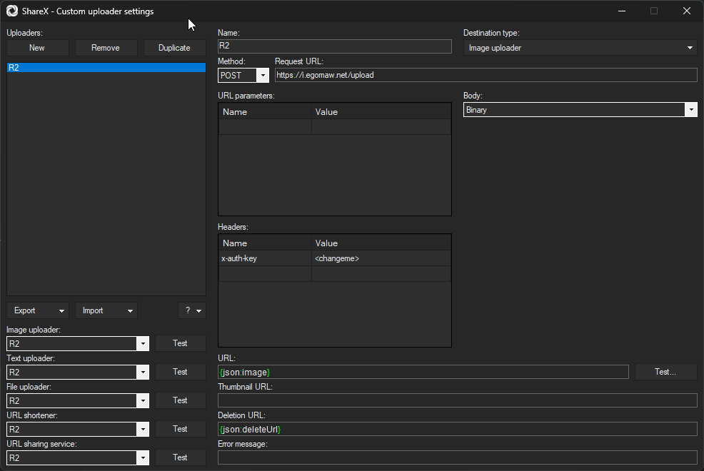

# File Uploader with Cloudflare R2 and Workers

This is a simple file uploader using Cloudflare Workers and R2. I personally use it with ShareX, but can be used with any other tool that supports custom uploaders.
All credit goes to [James Ross](https://jross.me/) for the original work which you can find [here](https://github.com/Cherry/ShareX-R2-Cloudflare-Workers).
I've made some changes to benefit my setup such as using user-provided categories for folders and choosing between using the current Date or using no folders.

## Worker and R2 Setup

- Ensure you have wrangler installed and configured. See [here](https://developers.cloudflare.com/workers/get-started/guide/) for more details
- Clone repo (or fork?), and run `pnpm install` to install dependencies
- Choose a bucket name to use in the next steps. For this example, we are using `sharex-files`
- Edit `wrangler.toml` with your `account_id`, `routes`, and `r2_buckets.bucket_name`
- Run `pnpm wrangler r2 bucket create <bucket name>`
- Generate a random string of characters - this will be used for an `AUTH_KEY` header that we'll send along with ShareX
	- This ensures that only you can upload to your script
- Run `pnpm wrangler secret put AUTH_KEY`, press Enter, and then type the random string you generated
- Run `pnpm wrangler deploy` to deploy the worker.

## ShareX Setup

For full documentation on ShareX custom uploaders, please review their documentation at https://getsharex.com/docs/custom-uploader.

- Open Main Window -> Destinations -> Custom Uploader Settings
- New -> Name it `R2` or whatever else you want
- Set the `Destination Type` to `Image uploader`
- Set the `Method` to `POST`
- Set the `Request URL` to the URL of your worker, with `/upload` appended, such as `https://i.egomaw.net/upload`
- Set the `Body` to `Binary`
- Leave URL paramaters blank
- (optional) Add a new URL paramater called `filename`, and set it to `{filename}`. If this is set, the original filename will be used when storing to R2, otherwise a random ID will be generated
- Add a new header under `Headers` called `x-Api-Key`, and set it to the secure string you generated earlier
- Set `URL` to `{json:image}`
- Set `Deletion URL` to `{json:deleteUrl}`
- Use the testers on the left-hand side to test your configuration
- When ready, change your default destination for images (etc.) to `R2`

